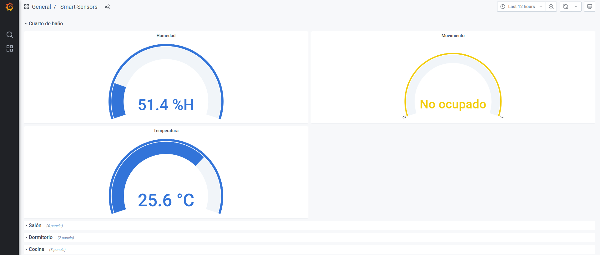
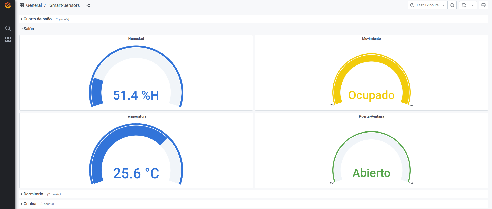
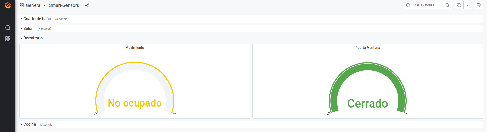
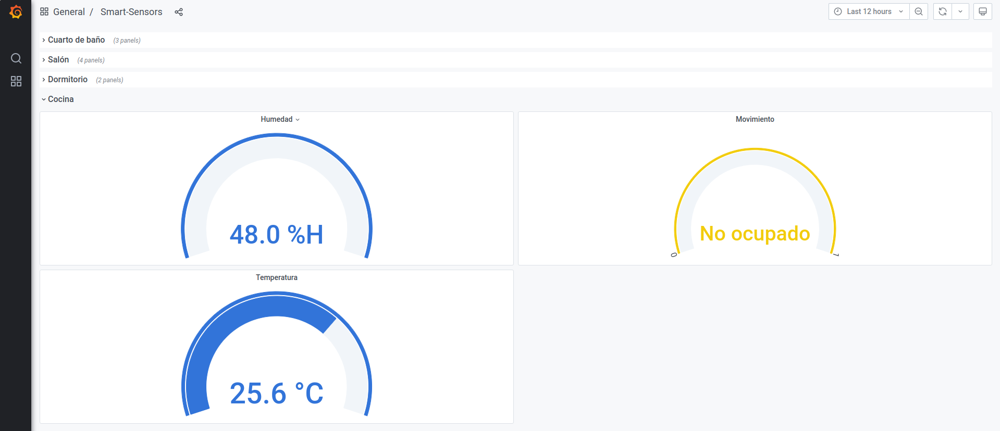

## monitoring-service - Monitoring system for smart sensors
Monitoring system that collects the data emitted by smart sensors and displays them in an intuitive way for the user

### Tools 🛠️
* A suported ZigBee adapter, such as zzh!
* One or more suported ZigBee device/s
* A Raspberry Pi 4 *(optional)*
* The `shapes-monitoring-system` debian package, which will configure ZigBee2MQTT, Mosquitto, InfluxDB, Telegraf and Grafana, available in [ARCO package repository](https://uclm-arco.github.io/debian/)
* Grafana APT repository, the latest OSS release, available in this [download link](https://grafana.com/docs/grafana/latest/installation/debian/)

### Install ⬇️ 
As a first step, the ARCO group repository is added
``` shell
pi@raspberrypi:~$ sudo apt-key adv --fetch -keys https://uclm-arco.github.io/debian/uclm-arco.asc
pi@raspberrypi:~$ echo "deb https://uclm-arco.github.io/debian/ sid main" | sudo tee /etc/apt/sources.list.d/arco.list
pi@raspberrypi:~$ sudo apt update
```

The `shapes-monitoring-system` package contains dependencies to install Grafana, so before installing the monitoring package it's necesaary to add the Grafana repository to the system

```shell
pi@raspberrypi:~$ sudo apt-get install -y apt-transport-https
pi@raspberrypi:~$ sudo apt-get install -y software-properties-common wget
pi@raspberrypi:~$ wget -q -O - https://packages.grafana.com/gpg.key | sudo apt-key add -
pi@raspberrypi:~$ echo "deb https://packages.grafana.com/oss/deb stable main" | sudo tee -a /etc/apt/sources.list.d/grafana.list
pi@raspberrypi:~$ sudo apt update
pi@raspberrypi:~$ sudo apt-get install grafana
```

Then we install the database client InfluxDB
```shell
pi@raspberrypi:~$ sudo apt-get install influxdb
```

Finally, the package containing the configuration files of the services that make up the system for monitoring the environment and the behaviour of the elderly person at home is installed

```shell
pi@raspberrypi:~$ sudo apt-get install shapes-monitoring-service
```

and the `paho-mqtt` library as it is used in the MQTT client

```shell
pi@raspberrypi:~$ pip3 install paho-mqtt
```

### Usage ⚙️
Considering that the installation has been carried out correctly, we now move on the running the monitoring system. To do this, we first generate the existing dependency trees in `systemd`

```shell
pi@raspberrypi:~$ sudo systemctl daemon-reload
```

and then we start the monitoring system and the Grafana server

```shell
pi@raspberrypi:~$ sudo systemctl start shapes-monitoring.service
pi@raspberrypi:~$ sudo systemctl start grafana-server.service
```

If the user wants the services start always the following commands are run

```shell
pi@raspberrypi:~$ sudo systemctl enable shapes-monitoring.service
pi@raspberrypi:~$ sudo systemctl enable grafana-server.service
```

Once the service is running we check the connection to the InfluxDB database and create the database necessary to collect the metrics published by the smart sensors. 

```shell 
pi@raspberrypi:~$ sudo shapes-monitoring -u
Connected to http://localhost:8086 version 1.8.5
    InfluxDB shell version: 1.6.4
    > create database zigbee2mqtt
    > use zigbee2mqtt
    Using database zigbee2mqtt
    > create user telegraf with password 'telegraf' with all privileges
    > grant all on zigbee2mqtt to telegraf
    > exit
Database checked!
Done updating!
```

If you want to visualize the information contained in dashboard that will be displayed in Grafana run

```shell
pi@raspberrypi:~$ sudo shapes-monitoring -s
INFO: Datasource provider file at /etc/grafana/provisioning/datasources/shapes-monitoring-datasource.yaml
INFO: Dashboard provider file at /etc/grafana/provisioning/dashboards/shapes-monitoring-dashboard.yaml
INFO: Found dashboard definition at /var/lib/grafana/dashboards/shapes-monitoring-dashboard.json:
INFO: 	Name: smart-sensors
INFO: 	UID: fFBmCCrMz
INFO: Available panels:
INFO: 	ID: 1	Description: Bathroom sensors
INFO: 	ID: 2	Description: Living room sensors
INFO: 	ID: 3	Description: Bedroom sensors
INFO: 	ID: 4	Description: Kitchen sensors
```

Then launch the MQTT client and it will start displaying the metrics transmitted by the sensors, which will then be published in a specific topic for the Telegraf agent to collect those metrics and store them in the InfluxDB database.

```shell
pi@raspberrypi:~$ shapes-monitoring-client
Connected to MQTT Broker localhost:1883 with return code 0!
Received {"battery":100,"contact":true,"linkquality":162,"voltage":3005} from zigbee2mqtt/door_window_living-room/SENSOR topic!
Sensor data: {'battery': 100, 'contact': 1, 'linkquality': 162, 'voltage': 3005}
Sensor data published to zigbee2mqtt/smart-sensors/living-room topic!

Received {"battery":100,"contact":true,"linkquality":158,"voltage":3005} from zigbee2mqtt/door_window_bedroom/SENSOR topic!
Sensor data: {'battery': 100, 'contact': 0, 'linkquality': 158, 'voltage': 3005}
Sensor data published to zigbee2mqtt/smart-sensors/bedroom topic!

Received {"battery":100,"contact":false,"linkquality":129,"voltage":3015} from zigbee2mqtt/door_window_living-room/SENSOR topic!
Sensor data: {'battery': 100, 'contact': 0, 'linkquality': 129, 'voltage': 3015}
Sensor data published to zigbee2mqtt/smart-sensors/living-room topic!

Received {"battery":100,"humidity":52.09,"linkquality":129,"pressure":947.6,"temperature":25.24, "voltage":3015} from zigbee2mqtt/temperature_humidity_living-room/SENSOR topic!
Sensor data published to zigbee2mqtt/smart-sensors/living-room topic!
```

By following these steps, you are ready to enter Grafana's [graphical interface](https://localhost:3000) and view the metrics collected about the home environment and the behaviour of the person in his or her home.

### Dashboards visualization 📊

* Bathroom sensors 


* Living-room sensors


* Bedroom sensors 


* Kitchen sensors 


